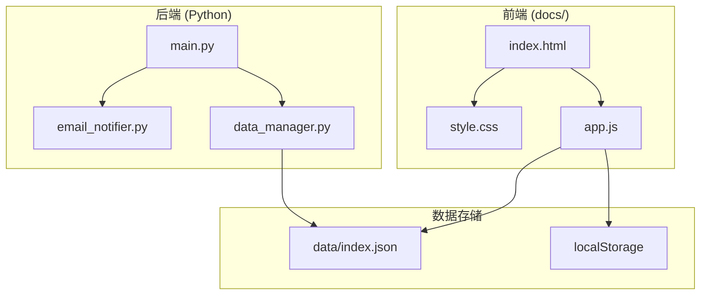

# Design Document: Literature UI Enhancement

## Overview

本设计文档描述文献追踪系统前端页面的增强方案，包括可折叠文献卡片、AI分类筛选、深色/浅色主题切换、响应式设计优化，以及邮件发送功能的bug修复。

技术栈：
- 前端：HTML5, CSS3, Vanilla JavaScript
- 后端：Python 3 (邮件模块)
- 数据：JSON文件存储

## Architecture



## Components and Interfaces

### 1. Literature Card Component (前端)

可折叠的文献卡片组件，支持展开/折叠状态切换。

```javascript
// 卡片状态管理
interface ArticleCardState {
    id: string;
    isExpanded: boolean;
}

// 卡片数据结构
interface Article {
    id: string;
    title: string;           // 英文标题
    title_zh: string;        // 中文标题
    abstract: string;        // 英文摘要
    abstract_zh: string;     // 中文摘要
    journal: string;         // 期刊名称
    pub_date: string;        // 发表日期
    authors: string[];       // 作者列表
    link: string;            // 原文链接
    is_favorite: boolean;    // 是否收藏
}

// 卡片渲染函数
function createArticleCard(article: Article, isExpanded: boolean): string
function toggleCardExpansion(articleId: string): void
```

### 2. Category Filter Component (前端)

AI分类筛选组件，根据关键词对文献进行分类。

```javascript
// AI关键词列表
const AI_KEYWORDS = ['machine', 'learn', 'neural', 'network'];

// 分类类型
type CategoryType = 'all' | 'ai-related' | 'ai-unrelated';

// 分类函数
function isAIRelated(article: Article): boolean {
    const text = (article.title + ' ' + article.title_zh + ' ' + 
                  article.abstract + ' ' + article.abstract_zh).toLowerCase();
    return AI_KEYWORDS.some(keyword => text.includes(keyword));
}

// 筛选函数
function filterByCategory(articles: Article[], category: CategoryType): Article[]
```

### 3. Theme Switcher Component (前端)

主题切换组件，支持深色/浅色模式。

```javascript
// 主题类型
type ThemeType = 'light' | 'dark';

// 主题管理
const THEME_STORAGE_KEY = 'literature_theme';

function getCurrentTheme(): ThemeType
function setTheme(theme: ThemeType): void
function toggleTheme(): void
function initTheme(): void
```

### 4. Pagination System (前端)

分页系统，每页显示50篇文献。

```javascript
const PAGE_SIZE = 50;

function getCurrentPageArticles(articles: Article[], page: number): Article[]
function getTotalPages(totalArticles: number): number
function renderPagination(currentPage: number, totalPages: number): void
```

### 5. Email Notifier (后端)

邮件通知模块，修复SSL/TLS连接问题。

```python
class EmailNotifier:
    def __init__(self, smtp_server: str, smtp_port: int, 
                 sender_email: str, sender_password: str):
        """初始化邮件通知器"""
        
    def validate_config(self) -> tuple[bool, str]:
        """验证邮件配置完整性"""
        
    def send_notification(self, recipient: str, articles: list) -> bool:
        """发送新文献通知邮件，包含完善的错误处理"""
```

## Data Models

### Article Data Model

```json
{
    "id": "string",
    "title": "string",
    "title_zh": "string",
    "abstract": "string",
    "abstract_zh": "string",
    "journal": "string",
    "pub_date": "YYYY-MM-DD",
    "authors": ["string"],
    "link": "string",
    "is_favorite": "boolean"
}
```

### Theme State (localStorage)

```json
{
    "key": "literature_theme",
    "value": "light" | "dark"
}
```

### Card Expansion State (内存)

```javascript
// 使用Set存储展开的卡片ID
expandedCards: Set<string>
```

## Correctness Properties

*A property is a characteristic or behavior that should hold true across all valid executions of a system-essentially, a formal statement about what the system should do. Properties serve as the bridge between human-readable specifications and machine-verifiable correctness guarantees.*

### Property 1: Card Toggle Consistency

*For any* Literature_Card, clicking it should toggle its expansion state - if it was collapsed, it becomes expanded; if it was expanded, it becomes collapsed.

**Validates: Requirements 1.2, 1.3**

### Property 2: Pagination Size Constraint

*For any* page number within valid range, the number of articles returned should be at most PAGE_SIZE (50), and exactly PAGE_SIZE for non-final pages.

**Validates: Requirements 2.1**

### Property 3: AI Classification Correctness

*For any* article, if its title or abstract (English or Chinese) contains any of the AI_KEYWORDS (case-insensitive), it should be classified as "AI-related"; otherwise, it should be classified as "AI-unrelated".

**Validates: Requirements 3.2, 3.3, 3.5**

### Property 4: Category Filter Completeness

*For any* set of articles and any category filter selection, the filtered result should be a subset of the original articles, and the union of "AI-related" and "AI-unrelated" filters should equal the full set.

**Validates: Requirements 3.4**

### Property 5: Theme Persistence Round-Trip

*For any* theme selection, saving to localStorage and then loading should return the same theme value.

**Validates: Requirements 4.4, 4.5**

### Property 6: Theme Toggle Idempotence

*For any* initial theme state, toggling the theme twice should return to the original state.

**Validates: Requirements 4.2**

### Property 7: Email Config Validation

*For any* email configuration, the validation function should return false with a meaningful error message if any required field (smtp_server, smtp_port, sender_email, sender_password) is missing or empty.

**Validates: Requirements 7.5**

### Property 8: Keyboard Navigation Bounds

*For any* list of articles and any sequence of 'j' and 'k' key presses, the focused index should always remain within valid bounds (0 to length-1) or be -1 (no focus).

**Validates: Requirements 9.1, 9.2**

### Property 9: Keyword Highlighting Completeness

*For any* text containing AI keywords (in any case), the highlightKeywords function should wrap all occurrences with the highlight span, and the resulting HTML should contain the same text content.

**Validates: Requirements 10.1, 10.2, 10.3**

### 6. Keyboard Navigation (前端)

键盘快捷键支持，提升浏览效率。

```javascript
// 当前聚焦的文献索引
let focusedIndex: number = -1;

// 键盘事件处理
function handleKeyPress(event: KeyboardEvent): void {
    switch(event.key) {
        case 'j': focusNext(); break;      // 下一篇
        case 'k': focusPrev(); break;      // 上一篇
        case 'Enter': toggleFocused(); break; // 展开/折叠
        case 'o': openFocused(); break;    // 打开原文
        case 's': starFocused(); break;    // 收藏
    }
}

function focusNext(): void
function focusPrev(): void
function toggleFocused(): void
function openFocused(): void
function starFocused(): void
```

### 7. Quick Preview Tooltip (前端)

悬停预览提示框，快速查看摘要。

```javascript
// 显示预览提示框
function showPreviewTooltip(articleId: string, event: MouseEvent): void
function hidePreviewTooltip(): void
```

### 8. Keyword Highlighter (前端)

关键词高亮组件，将匹配的关键词以粗体红色显示。

```javascript
// AI关键词列表（用于高亮）
const AI_KEYWORDS = ['machine', 'learn', 'neural', 'network'];

// 高亮函数 - 将文本中的关键词包装为高亮span
function highlightKeywords(text: string): string {
    // 创建正则表达式匹配所有关键词（大小写不敏感）
    const pattern = new RegExp(`(${AI_KEYWORDS.join('|')})`, 'gi');
    return text.replace(pattern, '<span class="keyword-highlight">$1</span>');
}

// CSS样式
// .keyword-highlight {
//     color: #dc2626;  /* 红色 */
//     font-weight: bold;
// }
// [data-theme="dark"] .keyword-highlight {
//     color: #f87171;  /* 深色模式下的红色 */
// }
```

## Error Handling

### Frontend Errors

1. **数据加载失败**
   - 显示友好的错误提示
   - 提供重试按钮

2. **localStorage不可用**
   - 降级处理，使用内存存储
   - 主题和收藏功能仍可使用，但不持久化

3. **无效的文章数据**
   - 跳过无效数据
   - 在控制台记录警告

### Backend Errors (Email)

1. **配置不完整**
   - 返回 False 并记录具体缺失的配置项
   - 不尝试发送邮件

2. **SMTP连接失败**
   - 捕获 socket.error 和 smtplib.SMTPException
   - 记录详细错误信息（服务器、端口、错误类型）

3. **认证失败**
   - 捕获 smtplib.SMTPAuthenticationError
   - 提示检查邮箱和授权码

4. **发送失败**
   - 捕获所有异常
   - 返回 False 并记录错误详情

## Testing Strategy

### Unit Tests

使用 JavaScript 测试框架（如 Jest）进行前端单元测试：

1. **AI分类函数测试**
   - 测试包含各种关键词的文章
   - 测试大小写不敏感
   - 测试边界情况（空字符串、null值）

2. **分页函数测试**
   - 测试不同数量的文章
   - 测试边界页码

3. **主题函数测试**
   - 测试主题切换
   - 测试localStorage读写

### Property-Based Tests

使用 fast-check 进行属性测试，每个测试运行至少100次迭代：

1. **Property 1 测试**: 卡片切换一致性
2. **Property 2 测试**: 分页大小约束
3. **Property 3 测试**: AI分类正确性
4. **Property 4 测试**: 分类筛选完整性
5. **Property 5 测试**: 主题持久化往返
6. **Property 6 测试**: 主题切换幂等性
7. **Property 7 测试**: 邮件配置验证

### Python Tests

使用 pytest 和 hypothesis 进行后端测试：

1. **邮件配置验证测试**
2. **错误处理测试**（使用mock模拟SMTP失败）

## CSS Design Tokens

### Light Theme

```css
:root {
    --bg-primary: #f5f7fa;
    --bg-secondary: #ffffff;
    --bg-card: #ffffff;
    --text-primary: #333333;
    --text-secondary: #666666;
    --text-muted: #888888;
    --accent-primary: #667eea;
    --accent-secondary: #764ba2;
    --border-color: #e0e0e0;
    --shadow-color: rgba(0, 0, 0, 0.08);
}
```

### Dark Theme

```css
[data-theme="dark"] {
    --bg-primary: #1a1a2e;
    --bg-secondary: #16213e;
    --bg-card: #1f2937;
    --text-primary: #e5e7eb;
    --text-secondary: #9ca3af;
    --text-muted: #6b7280;
    --accent-primary: #818cf8;
    --accent-secondary: #a78bfa;
    --border-color: #374151;
    --shadow-color: rgba(0, 0, 0, 0.3);
}
```

## Responsive Breakpoints

```css
/* Mobile: < 768px */
@media (max-width: 767px) {
    /* 单列布局，增大触摸目标 */
}

/* Tablet: 768px - 1024px */
@media (min-width: 768px) and (max-width: 1024px) {
    /* 适中布局 */
}

/* Desktop: > 1024px */
@media (min-width: 1025px) {
    /* 完整桌面布局 */
}
```
